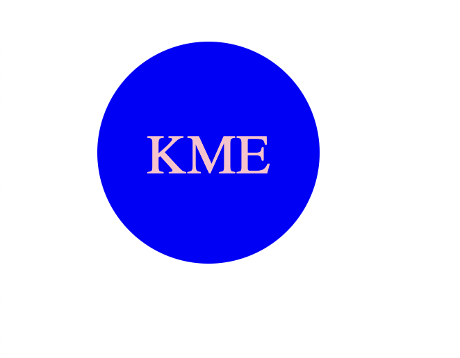

# SVG Logo Generator

## Description

This application was created in order to help generator quick and easy SVG logos by answering a few simple prompts. This application is extrememly user-friendly and generates your specific logo in seconds.

## Installation

In order to use this application, you must have inquirer installed. To do this run npm i inquirer@8.2.4 in your command line.

Next in your command line, input npm run start, you will be then be prompted with a short series of questions pertaining to your logo. After you finish desiging your logo a logo.svg will be generated with your logo. You will know it worked when you see a "Generated logo.svg" message in your command line. Open this file in your browser, and you should see your logo!

## Usage

Video Tutorial: https://drive.google.com/file/d/1rE8gD-3-I3tv95PMZ1GXg9LXEyfUX5sX/view?usp=sharing
